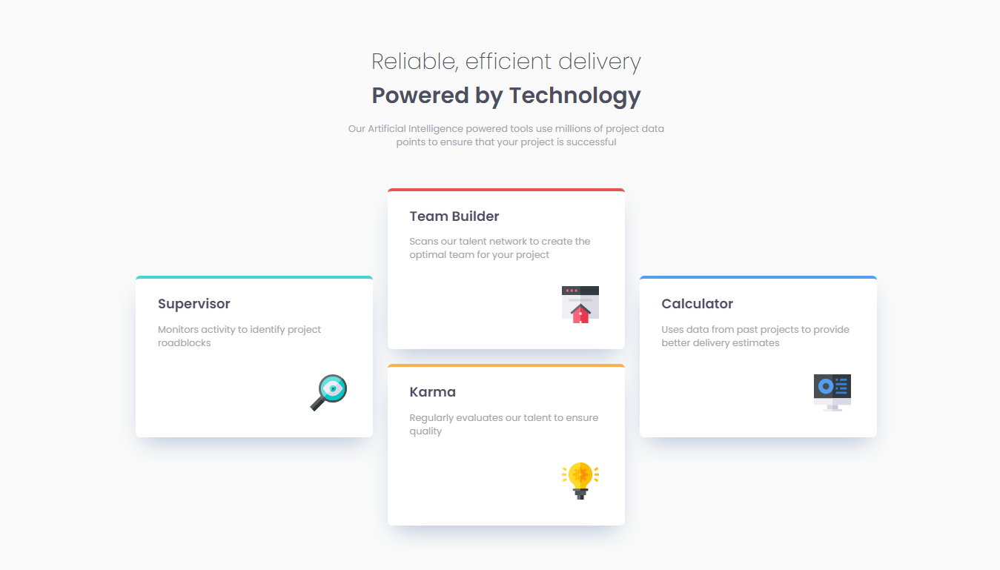

# Frontend Mentor - Four card feature section solution

This is a solution to the [Four card feature section challenge on Frontend Mentor](https://www.frontendmentor.io/challenges/four-card-feature-section-weK1eFYK). Frontend Mentor challenges help you improve your coding skills by building realistic projects. 

## Table of contents

- [Overview](#overview)
  - [The challenge](#the-challenge)
  - [Screenshot](#screenshot)
  - [Links](#links)
  - [Built with](#built-with)
  - [Useful resources](#useful-resources)
- [Author](#author)
- [Acknowledgments](#acknowledgments)

## Overview

### The challenge

Users should be able to:

- View the optimal layout for the site depending on their device's screen size

### Screenshot

     

### Links
- Source Code URL : (https://mega.nz/file/eLAQAZzQ#BsUDotFfClDhyi-X6XSNeWyiwX59MipAz1tHRS3rdFI)
- Solution URL: (https://didier-ds.github.io/Frontend-Mentor/cards/)
- Live Site URL: (http://card-project.surge.sh/)

## My process

### Built with

- Semantic HTML5 markup
- CSS custom properties
- Flexbox

### Useful resources

- [Example resource 1](https://css-tricks.com/snippets/css/a-guide-to-flexbox/) - This helped me for the FlexBox. I really liked this pattern and will use it going forward.

## Author

- Website - [https://www.didiersenou.com]
- Frontend Mentor - [https://www.frontendmentor.io/profile/Didier-ds]
- Twitter - [https://twitter.com/DdyJiggy]

## Acknowledgments

i acknowledge the fact that frontendmentor.io gave us newbies the opportunity to test our abilities
